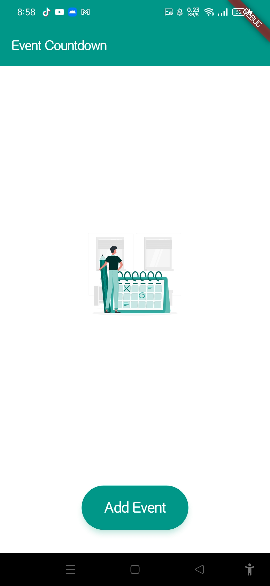
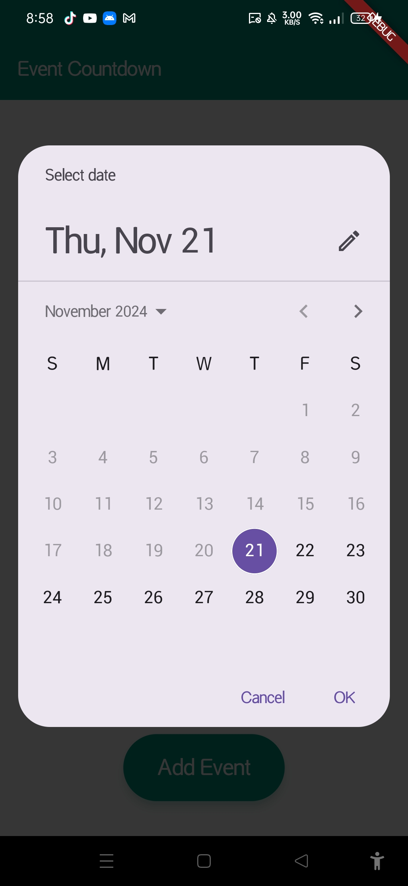
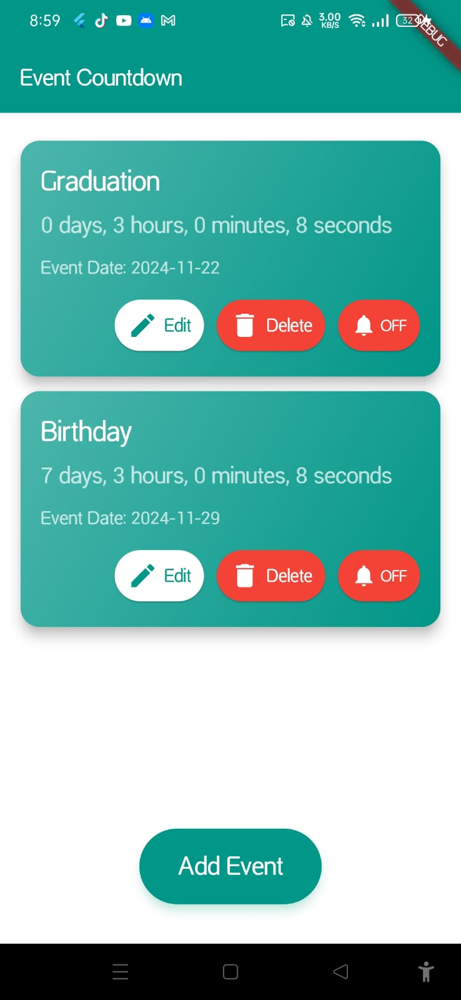
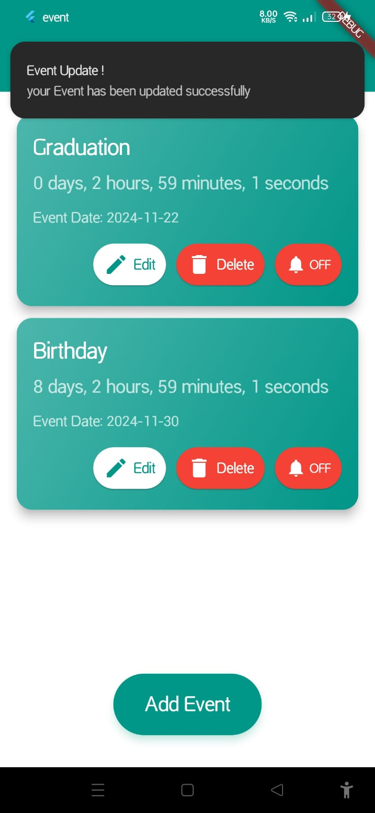
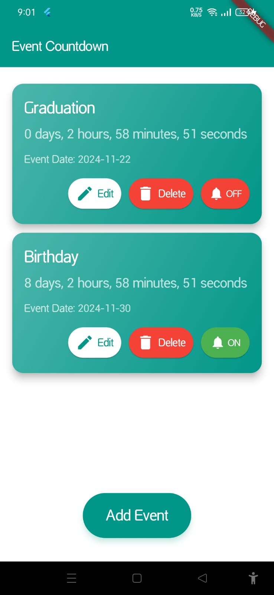

Event Countdown App
---------------------------
An event countdown app built with Flutter, featuring a calendar for setting events, live countdown timers, and customizable reminder notifications. This app implements MVVM architecture, uses Room Database, and is fully responsive across different devices.

Features
--------------------------
🏁 Welcome Screen
A user-friendly starting screen to introduce the app.
📅 Add Events
Create events by choosing a name and date from an interactive calendar.
⏳ Live Countdown
Each event is displayed with a live countdown timer to its scheduled day.
✏️ Edit Events
Update event details (name, date, and time).
Receive a confirmation notification after successfully editing an event.
🔔 Notification Reminders
Toggle reminders on/off for each event with a single button.
Get notified about upcoming events.
🗑️ Delete Events
Remove events easily with a dedicated delete button.
📱 Fully Responsive
Seamless experience on all screen sizes and orientations.

Project Structure
---------------------------
The app follows the MVVM Architecture with a well-organized structure:
├── assets  
│   └── images
├── dao  
│   └── event_dao.dart  
├── models  
│   └── event.dart  
├── repositories  
│   └── event_repository.dart  
├── services  
│   ├── event_database_helper.dart  
│   └── local_notification_service.dart  
├── view_models  
│   ├── event_view_model.dart  
│   └── notification_view_model.dart  
├── views  
│   ├── event_card.dart  
│   └── event_home_page.dart  
├── widgets  
│   ├── add_event_dialog.dart  
│   ├── edit_event_dialog.dart  
│   ├── event_app_bar.dart  
│   ├── event_button.dart  
│   └── event_list.dart  
└── main.dart

Tech Stack
----------------------------
Flutter: Framework
Room Database: Local storage
MVVM: Architecture pattern
Dart: Programming language

Screenshots
---------------------------
### Welcome Screen

### Add Event Screen

### Event Card with Live Countdown

### Notification Dialog

### Reminder ON/OFF

Future Enhancements
-----------------------------
Support for recurring events.
Additional customization options for notifications.
Dark mode support.
